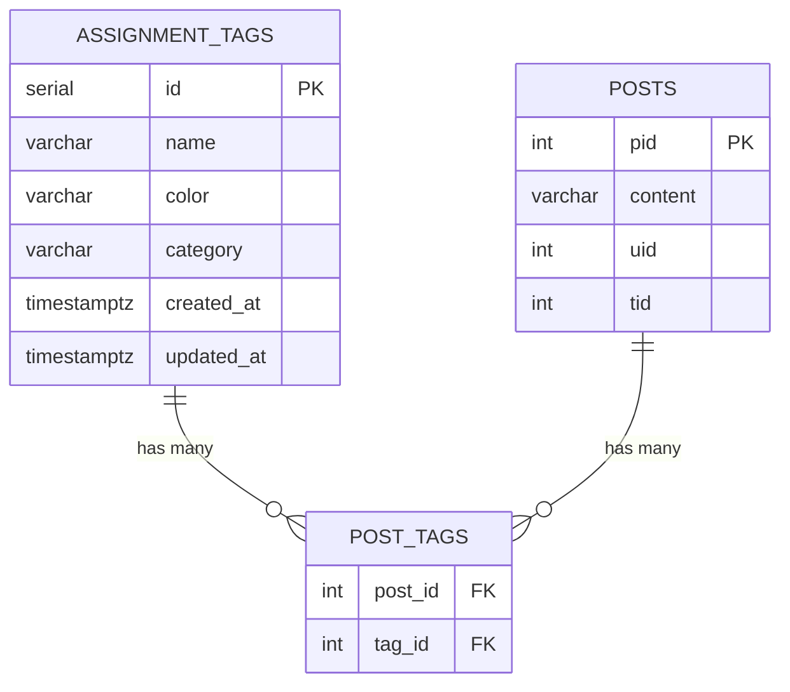
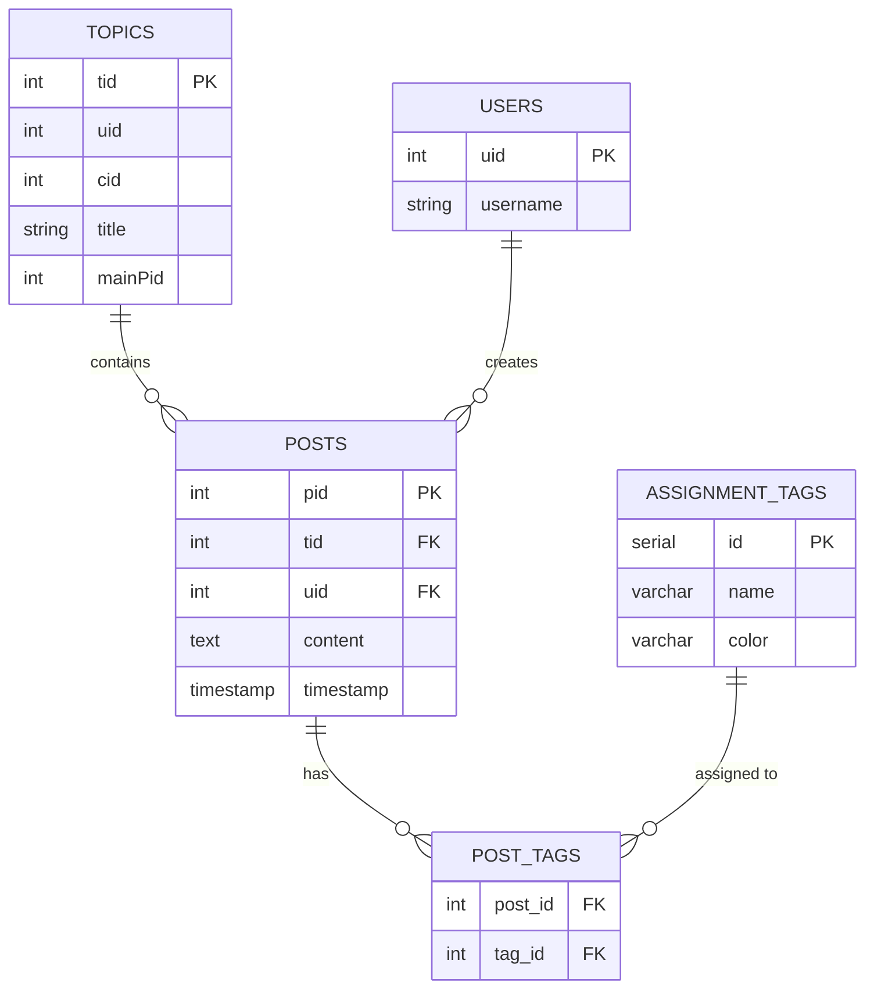

# Assignment Tags Database Schema

## Overview

The Assignment Tags feature uses two PostgreSQL tables to manage tags and their relationships with posts:

1. **`assignment_tags`** - Stores tag definitions (name, color, category)
2. **`post_tags`** - Junction table linking posts to tags (many-to-many relationship)

**Database Requirement:** PostgreSQL 9.5+ (uses SERIAL and TIMESTAMPTZ types)

---

## Entity Relationship Diagram



### Relationships

- **assignment_tags** 1:N **post_tags**: One tag can be assigned to many posts
- **posts** 1:N **post_tags**: One post can have many tags
- **Many-to-Many**: Posts and tags have a many-to-many relationship via the `post_tags` junction table

---

## Table Schemas

### `assignment_tags`

Stores tag definitions with metadata.

| Column | Type | Constraints | Description |
|--------|------|-------------|-------------|
| `id` | SERIAL | PRIMARY KEY | Auto-incrementing unique identifier |
| `name` | VARCHAR(255) | NOT NULL | Display name of the tag |
| `color` | VARCHAR(7) | DEFAULT '#3498db' | Hex color code for visual display |
| `category` | VARCHAR(255) | NULL | Optional grouping category |
| `created_at` | TIMESTAMPTZ | DEFAULT NOW() | Timestamp when tag was created |
| `updated_at` | TIMESTAMPTZ | DEFAULT NOW() | Timestamp of last update |

**Indexes:**

- Primary key index on `id`
- Index on `name` for search operations (created automatically)

**SQL Definition:**

```sql
CREATE TABLE IF NOT EXISTS "assignment_tags" (
    "id" SERIAL PRIMARY KEY,
    "name" VARCHAR(255) NOT NULL,
    "color" VARCHAR(7) DEFAULT '#3498db',
    "category" VARCHAR(255),
    "created_at" TIMESTAMPTZ DEFAULT NOW(),
    "updated_at" TIMESTAMPTZ DEFAULT NOW()
);
```

**Example Data:**

| id | name | color | category | created_at | updated_at |
|----|------|-------|----------|------------|------------|
| 1 | Homework | #FF5733 | Assignments | 2024-02-27 10:00:00+00 | 2024-02-27 10:00:00+00 |
| 2 | Exam | #3498db | Assessments | 2024-02-27 10:05:00+00 | 2024-02-27 10:05:00+00 |
| 3 | Discussion | #2ECC71 | Participation | 2024-02-27 10:10:00+00 | 2024-02-27 10:10:00+00 |

---

### `post_tags`

Junction table linking posts to tags (many-to-many relationship).

| Column | Type | Constraints | Description |
|--------|------|-------------|-------------|
| `post_id` | INTEGER | FOREIGN KEY, NOT NULL | References `posts.pid` |
| `tag_id` | INTEGER | FOREIGN KEY, NOT NULL | References `assignment_tags.id` |

**Constraints:**

- **Composite Primary Key:** (`post_id`, `tag_id`)
- **Foreign Key:** `post_id` → `posts(pid)` ON DELETE CASCADE
- **Foreign Key:** `tag_id` → `assignment_tags(id)` ON DELETE CASCADE

**Indexes:**

- Composite primary key index on (`post_id`, `tag_id`)
- Index on `tag_id` for reverse lookups (find posts by tag)
- Index on `post_id` for lookups (find tags by post)

**SQL Definition:**

```sql
CREATE TABLE IF NOT EXISTS "post_tags" (
    "post_id" INTEGER NOT NULL,
    "tag_id" INTEGER NOT NULL,
    PRIMARY KEY ("post_id", "tag_id"),
    CONSTRAINT "fk_post_tags_post_id"
        FOREIGN KEY ("post_id")
        REFERENCES "posts"("pid")
        ON DELETE CASCADE,
    CONSTRAINT "fk_post_tags_tag_id"
        FOREIGN KEY ("tag_id")
        REFERENCES "assignment_tags"("id")
        ON DELETE CASCADE
);

CREATE INDEX IF NOT EXISTS "idx_post_tags_post_id" ON "post_tags"("post_id");
CREATE INDEX IF NOT EXISTS "idx_post_tags_tag_id" ON "post_tags"("tag_id");
```

**Example Data:**

| post_id | tag_id |
|---------|--------|
| 123 | 1 |
| 123 | 3 |
| 456 | 1 |
| 456 | 2 |
| 789 | 3 |

This example shows:
- Post 123 has tags 1 (Homework) and 3 (Discussion)
- Post 456 has tags 1 (Homework) and 2 (Exam)
- Post 789 has tag 3 (Discussion)

---

## Integration with NodeBB Core

The assignment tags tables integrate with NodeBB's existing `posts` table:



### Key Integration Points:

1. **Topics → Posts → Tags**
   - Each topic has a `mainPid` (main post)
   - Tags are assigned to posts, not topics directly
   - Topic filtering works by checking tags on the main post

2. **Cascade Deletes**
   - Deleting a post removes its tag associations
   - Deleting a tag removes all post associations
   - NodeBB post deletion automatically cascades to `post_tags`

3. **Data Fetching**
   - Post data includes `assignmentTags` array
   - Tags fetched via JOIN on `post_tags`

---

## Query Patterns

### Common Queries

#### Get all tags for a post

```sql
SELECT at.id, at.name, at.color, at.category
FROM assignment_tags at
INNER JOIN post_tags pt ON pt.tag_id = at.id
WHERE pt.post_id = $1
ORDER BY at.name;
```

#### Get all posts with a specific tag

```sql
SELECT post_id
FROM post_tags
WHERE tag_id = $1;
```

#### Get all posts with any of multiple tags (OR)

```sql
SELECT DISTINCT post_id
FROM post_tags
WHERE tag_id = ANY($1::int[]);
```

#### Assign multiple tags to a post (replace existing)

```sql
BEGIN;

-- Remove existing tags
DELETE FROM post_tags WHERE post_id = $1;

-- Insert new tags
INSERT INTO post_tags (post_id, tag_id)
SELECT $1, unnest($2::int[]);

COMMIT;
```

#### Get posts with tag counts

```sql
SELECT p.pid, COUNT(pt.tag_id) as tag_count
FROM posts p
LEFT JOIN post_tags pt ON pt.post_id = p.pid
GROUP BY p.pid;
```

#### Find most popular tags

```sql
SELECT at.id, at.name, COUNT(pt.post_id) as post_count
FROM assignment_tags at
LEFT JOIN post_tags pt ON pt.tag_id = at.id
GROUP BY at.id, at.name
ORDER BY post_count DESC
LIMIT 10;
```

---

## Performance Considerations

### Indexing Strategy

1. **Composite Primary Key** on `post_tags(post_id, tag_id)`
   - Ensures uniqueness
   - Fast lookups for "Does this post have this tag?"

2. **Index on `post_tags.tag_id`**
   - Optimizes "Find all posts with this tag" queries
   - Critical for filtering operations

3. **Index on `post_tags.post_id`**
   - Optimizes "Find all tags for this post" queries
   - Used when loading post data with tags

4. **Index on `assignment_tags.name`** (optional)
   - Useful for tag search/autocomplete
   - Can be added if tag search is implemented

### Query Optimization Tips

- Use `ANY($1::int[])` for multiple tag filtering instead of multiple ORs
- Fetch tags in batches for multiple posts to reduce query count
- Consider caching frequently accessed tags in Redis
- Use `DISTINCT` when querying multiple tags to avoid duplicate posts

### Expected Performance

With proper indexing:

| Operation | Rows | Expected Time |
|-----------|------|---------------|
| Get tags for 1 post | <10 | <1ms |
| Get tags for 100 posts (batch) | <1000 | <10ms |
| Filter topics by 1 tag | Varies | <50ms |
| Filter topics by 3 tags | Varies | <100ms |
| Create/update tag | 1 | <5ms |
| Delete tag | Varies | <50ms |

---

## Data Constraints & Validation

### Application-Level Validation

The following validations are enforced in the application code:

1. **Tag Name**
   - Required (cannot be empty)
   - Maximum length: 255 characters
   - XSS sanitization applied

2. **Color**
   - Optional (defaults to #3498db)
   - Should be valid hex format (#RRGGBB)
   - Validation not strictly enforced (invalid colors may be stored)

3. **Category**
   - Optional (can be NULL or empty string)
   - Maximum length: 255 characters
   - Used for grouping in UI

4. **Tag IDs**
   - Must be positive integers
   - Must exist in `assignment_tags` table (enforced by foreign key)

### Database-Level Constraints

1. **NOT NULL constraints** on critical fields
2. **FOREIGN KEY constraints** with CASCADE DELETE
3. **PRIMARY KEY constraints** for uniqueness
4. **DEFAULT values** for color and timestamps

---

## Migration

The database schema is created via migration file:

**File:** `src/upgrades/1.20.0/assignment_tags_schema.js`

**Execution:** Runs automatically on `./nodebb upgrade` when NodeBB version >= 1.20.0

**Safety:**
- Uses `IF NOT EXISTS` to avoid errors on re-run
- Only executes if database is PostgreSQL
- Logs errors without failing entire upgrade process

**Rollback:**

To manually remove the assignment tags tables:

```sql
-- Remove junction table first (foreign keys)
DROP TABLE IF EXISTS post_tags;

-- Then remove tags table
DROP TABLE IF EXISTS assignment_tags;
```

⚠️ **Warning:** Rollback will permanently delete all tags and tag assignments.

---

## Backup & Restore

### Backup Tags

```bash
# Export assignment tags data
pg_dump -U username -d nodebb \
  -t assignment_tags \
  -t post_tags \
  --data-only \
  > assignment_tags_backup.sql
```

### Restore Tags

```bash
# Import assignment tags data
psql -U username -d nodebb < assignment_tags_backup.sql
```

### Full Database Backup

```bash
# Complete backup including tags
pg_dump -U username -d nodebb > nodebb_full_backup.sql
```

---

## Monitoring & Maintenance

### Health Checks

```sql
-- Check for orphaned post_tags (shouldn't exist with CASCADE)
SELECT pt.post_id, pt.tag_id
FROM post_tags pt
LEFT JOIN posts p ON p.pid = pt.post_id
LEFT JOIN assignment_tags at ON at.id = pt.tag_id
WHERE p.pid IS NULL OR at.id IS NULL;

-- Count total tags and assignments
SELECT
  (SELECT COUNT(*) FROM assignment_tags) as total_tags,
  (SELECT COUNT(*) FROM post_tags) as total_assignments,
  (SELECT COUNT(DISTINCT post_id) FROM post_tags) as posts_with_tags;
```

### Table Sizes

```sql
-- Check table sizes
SELECT
  table_name,
  pg_size_pretty(pg_total_relation_size(quote_ident(table_name))) as size
FROM information_schema.tables
WHERE table_schema = 'public'
  AND table_name IN ('assignment_tags', 'post_tags')
ORDER BY pg_total_relation_size(quote_ident(table_name)) DESC;
```

### Index Usage

```sql
-- Check if indexes are being used
SELECT
  schemaname,
  tablename,
  indexname,
  idx_scan as index_scans,
  idx_tup_read as tuples_read,
  idx_tup_fetch as tuples_fetched
FROM pg_stat_user_indexes
WHERE tablename IN ('assignment_tags', 'post_tags')
ORDER BY idx_scan DESC;
```

---

## Future Enhancements

Potential schema improvements for future versions:

1. **Tag Descriptions**
   - Add `description` TEXT field to `assignment_tags`
   - Helpful for explaining tag purpose to users

2. **Tag Icons**
   - Add `icon` VARCHAR field for Font Awesome icon class
   - Enhance visual representation

3. **Tag Permissions**
   - Add `creator_uid` field to track who created the tag
   - Add `permissions` JSONB field for fine-grained access control

4. **Tag Usage Stats**
   - Add `usage_count` INTEGER with trigger to auto-update
   - Faster "popular tags" queries without COUNT(*)

5. **Tag Hierarchy**
   - Add `parent_id` FOREIGN KEY to support nested tags
   - Enable tag categories with subtags

6. **Soft Deletes**
   - Add `deleted_at` TIMESTAMPTZ field
   - Allow tag restoration and audit trail

7. **Full-Text Search**
   - Add GIN index on `name` for better search
   - Support fuzzy tag matching

---

## Troubleshooting

### Common Issues

1. **Migration doesn't run**
   - Verify PostgreSQL is configured in `config.json`
   - Check NodeBB version is >= 1.20.0
   - Run `./nodebb upgrade` manually

2. **Foreign key violations**
   - Ensure posts exist before assigning tags
   - Check tag IDs are valid before insertion

3. **Slow tag filtering**
   - Verify indexes exist: `\d post_tags` in psql
   - Check query plans: `EXPLAIN ANALYZE <your query>`
   - Consider adding missing indexes

4. **Disk space issues**
   - Large `post_tags` tables with many tags per post
   - Run `VACUUM ANALYZE` periodically
   - Monitor table sizes with queries above

---

## References

- **PostgreSQL Documentation:** https://www.postgresql.org/docs/
- **NodeBB Database Documentation:** https://docs.nodebb.org/
- **Migration file:** `/src/upgrades/1.20.0/assignment_tags_schema.js`
- **Business logic:** `/src/assignment-tags/index.js`

---

## Changelog

### Version 1.0.0 (2024-02-27)
- Initial schema design
- Two-table structure with junction table
- Cascade delete constraints
- Optimized indexes for common queries
